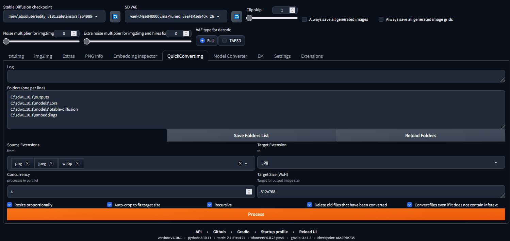

# SD Webui Quick Convert Image

This is an Extension for the [Automatic1111 Webui](https://github.com/AUTOMATIC1111/stable-diffusion-webui), 
which allows you to mass-convert image(s) to other formats, while keeping their embedded infotext. 

QuickConvertImg is a simple and efficient tool for batch image processing. 

It helps you automatically scan folders, convert images to a single format, and resize them proportionally with center cropping—perfect for preparing thumbnails or optimizing large image collections.

Key Features:
- Automatic folder scanning 📁 – Define a list of folders to scan and process images automatically.
- Multi-format conversion 🔄 – Convert multiple image formats (PNG, JPEG, WebP, AVIF…) into a single target format.
- Proportional resizing with center crop ✂️ – Resize images while preserving aspect ratio and optionally crop the center to fit the target size.

Inspired from rewrite-history: https://github.com/Haoming02/sd-webui-rewrite-history

